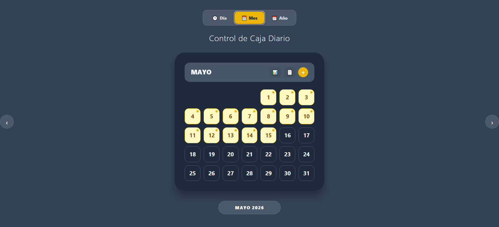
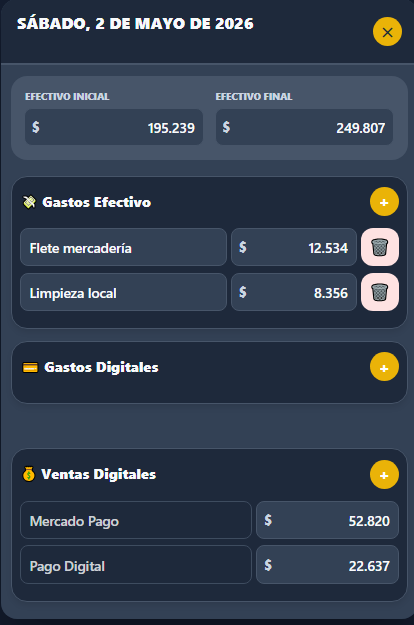
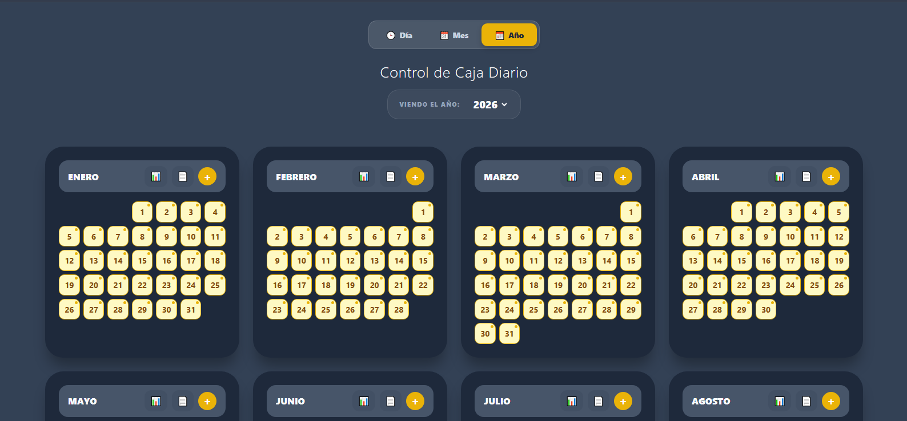
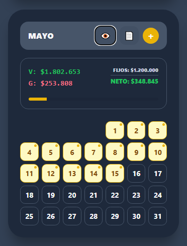

# 📊 Daily Box Control

**Control de Caja Diario** es una aplicación web moderna diseñada para simplificar el cierre de caja y el seguimiento financiero de pequeños y medianos comercios. Enfocada en la simplicidad y la agilidad, permite a dueños y empleados registrar movimientos diarios en menos de 2 minutos.

[](https://balance-five-gamma.vercel.app/)
[](https://reactjs.org/)
[](https://firebase.google.com/)

---

## ✨ Características Principales

*   **🔐 Sistema de Roles (RBAC):** Diferenciación entre perfiles **ADMIN** y **CLIENT**.
    *   *ADMIN:* Control total, visualización de ventas totales, gastos mensuales y acceso a planillas.
    *   *CLIENT:* Interfaz operativa simplificada, carga de movimientos sin acceso a cifras de rentabilidad total.
*   **⚡ Carga Rápida (Vista "Día"):** Botón de acción directa para abrir el formulario del día de la fecha sin clics innecesarios.
*   **🗓️ Navegación Inteligente:** Selector de vistas (Día / Mes / Año) con interfaz táctil deslizable (drag & swipe).
*   **🇦🇷 Formato Localizado:** Manejo automático de moneda argentina (punto para miles, coma para decimales).
*   **📑 Sincronización en Tiempo Real:** Todos los datos se guardan en **Firebase Firestore** y se exportan automáticamente a una **Planilla de Google Sheets**.
*   **📈 Resumen Mensual Visual:** Barra de progreso de gastos vs. ventas y cálculo automático de **Rendimiento Neto**.
*   **📱 Mobile First:** Interfaz optimizada para el uso diario desde celulares en el punto de venta.






## 🛠️ Stack Tecnológico

*   **Frontend:** React (Vite)
*   **Autenticación:** Firebase Auth
*   **Animaciones:** Framer Motion
*   **Backend & DB:** Firebase Firestore
*   **Fechas:** Luxon
*   **Integración:** Google Apps Script

---

## 📊 Integración con Google Sheets

Para automatizar la carga de datos en una hoja de cálculo, utiliza el siguiente código en **Google Apps Script**:

```javascript
function doPost(e) {
  try {
    var data = JSON.parse(e.postData.contents);
    var ss = SpreadsheetApp.getActiveSpreadsheet();
    var nombreHoja = data.month + " " + data.year;
    var sheet = ss.getSheetByName(nombreHoja);

    // Si la hoja no existe, la creamos con tu estructura
    if (!sheet) {
      sheet = ss.insertSheet(nombreHoja);

      var colores = ["#f87171", "#fb923c", "#fbbf24", "#4ade80", "#2dd4bf", "#38bdf8", "#818cf8", "#a78bfa", "#f472b6"];
      var colorAzar = colores[Math.floor(Math.random() * colores.length)];

      sheet.getRange("A1:E1").merge().setValue(nombreHoja.toUpperCase())
        .setBackground(colorAzar).setFontColor("white").setFontWeight("bold")
        .setHorizontalAlignment("center").setFontSize(14);

      sheet.getRange("A2").setValue("D");
      sheet.getRange("B2").setValue("Ventas");
      sheet.getRange("C2").setValue("Gastos");
      sheet.getRange("D2").setValue("Diferencia");
      sheet.getRange("E2").setValue("Acumulado");
      sheet.getRange("A2:E2")
        .setFontWeight("bold")
        .setBackground("#f3f3f3")
        .setHorizontalAlignment("center");

      for (var i = 1; i <= 31; i++) {
        var fila = i + 2;
        sheet.getRange(fila, 1).setValue(i);
        sheet.getRange(fila, 4).setFormula("=B" + fila + "-C" + fila);

        if (i === 1) {
          sheet.getRange(fila, 5).setFormula("=D" + fila);
        } else {
          sheet.getRange(fila, 5).setFormula("=E" + (fila - 1) + "+D" + fila);
        }
      }

      sheet.getRange("A34").setValue("TOTAL MES").setFontWeight("bold");
      sheet.getRange("B34").setFormula("=SUM(B3:B33)");
      sheet.getRange("C34").setFormula("=SUM(C3:C33)");
      sheet.getRange("D34").setFormula("=SUM(D3:D33)");
      sheet.getRange("A34:E34").setFontWeight("bold").setBackground("#EFEFEF");

      // Tabla de Impuestos y Servicios
      sheet.getRange("G1:H1").merge().setValue("IMPUESTOS Y SERVICIOS")
        .setBackground("#475569").setFontColor("white").setFontWeight("bold").setHorizontalAlignment("center");
      sheet.getRange("G2").setValue("Detalle").setFontWeight("bold");
      sheet.getRange("H2").setValue("Monto").setFontWeight("bold");
      sheet.getRange("G21").setValue("TOTAL IMPUESTOS").setFontWeight("bold");
      sheet.getRange("H21").setFormula("=SUM(H3:H20)").setFontWeight("bold").setBackground("#fee2e2");

      // Resumen Final
      sheet.getRange("J1:K1").merge().setValue("RESUMEN FINAL")
        .setBackground("#1e293b").setFontColor("white").setFontWeight("bold").setHorizontalAlignment("center");
      sheet.getRange("J2").setValue("Caja Acumulada");
      sheet.getRange("K2").setFormula("=D34");
      sheet.getRange("J3").setValue("Gastos Fijos");
      sheet.getRange("K3").setFormula("=H21");
      sheet.getRange("J5").setValue("RENDIMIENTO NETO").setFontWeight("bold").setFontSize(12);
      sheet.getRange("K5").setFormula("=K2-K3").setFontWeight("bold").setFontSize(12).setBackground("#dcfce7");

      // Formatos
      sheet.getRange("A2:E34").setBorder(true, true, true, true, true, true);
      sheet.getRange("G1:H21").setBorder(true, true, true, true, true, true);
      sheet.getRange("J1:K5").setBorder(true, true, true, true, true, true);
      sheet.getRange("B3:E34").setNumberFormat("$#,##0");
      sheet.getRange("H3:H21").setNumberFormat("$#,##0");
      sheet.getRange("K2:K5").setNumberFormat("$#,##0");
    }

    // --- LÓGICA DE CARGA ---

    // Caso 1: Gastos Mensuales (Fijos)
    if (data.type === 'monthly_fixed') {
      sheet.getRange("G3:H20").clearContent();

      if (data.expenses && data.expenses.length > 0) {
        var filasGastos = [];

        for (var j = 0; j < data.expenses.length; j++) {
          if (j < 18) {
            filasGastos.push([data.expenses[j].n, data.expenses[j].v]);
          }
        }

        if (filasGastos.length > 0) {
          sheet.getRange(3, 7, filasGastos.length, 2).setValues(filasGastos);
        }
      }

      return ContentService.createTextOutput(
        JSON.stringify({ result: 'success', type: 'fixed' })
      ).setMimeType(ContentService.MimeType.JSON);
    }

    // Caso 2: Carga Diaria
    else {
      var diaNumero = parseInt(data.fecha.split(" de ")[0]);
      var filaDestino = diaNumero + 2;

      sheet.getRange(filaDestino, 2).setValue(parseFloat(data.ventas) || 0);
      sheet.getRange(filaDestino, 3).setValue(parseFloat(data.gastos) || 0);
    }

    return ContentService.createTextOutput(
      JSON.stringify({ result: 'success', type: 'daily' })
    ).setMimeType(ContentService.MimeType.JSON);

  } catch (error) {
    return ContentService.createTextOutput(
      JSON.stringify({ result: 'error', error: error.toString() })
    ).setMimeType(ContentService.MimeType.JSON);
  }
}
```

---

## 🚀 Instalación y Configuración

### Variables de Entorno
Crea un archivo `.env` en la raíz del proyecto con tus credenciales:
```env
VITE_DB_FIRE=tu_coleccion_de_firebase
VITE_GOOGLE_SHEETS_URL=tu_url_de_google_script
VITE_SHEET_URL=tu_url_de_la_planilla_de_visualizacion
VITE_ENABLE_AUTH=true (Activa/Desactiva el login para demos)
```

---

## 💼 Visión Comercial

Esta aplicación está diseñada como una solución SaaS (Software as a Service) para:
*   Kioscos y almacenes.
*   Cafeterías y Gastronomía.
*   Showrooms y locales de ropa.

**Diferenciales:**
*   **Privacidad:** El dueño puede delegar la carga de datos sin exponer la rentabilidad real del negocio.
*   **Modo Demo:** Posibilidad de desplegar versiones de prueba sin login para potenciales clientes mediante configuración.

---
DEMO: https://balance-five-gamma.vercel.app/
Desarrollado por [Ignacio Salazar](https://github.com/ignaciosalazar986) 🇦🇷
